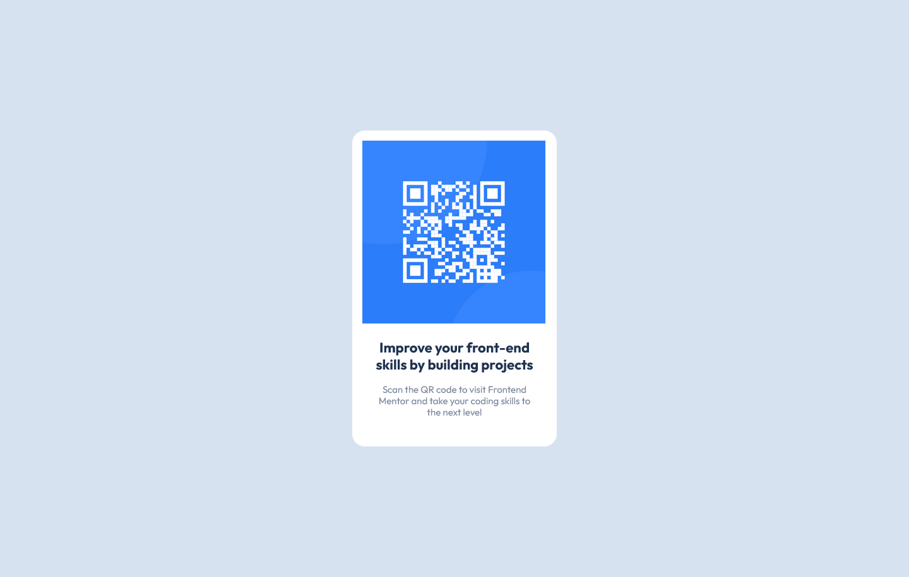

# QR code component

This is my solution to the QR code component challenge on Frontend Mentor

## Table of contents

- [Overview](#overview)
  - [Screenshot](#screenshot)
  - [Links](#links)
- [My process](#my-process)
  - [Built with](#built-with)
  - [Continued development](#continued-development)
  - [Useful resources](#useful-resources)
- [Author](#author)

## Overview

### Screenshot

### Links

- Solution URL: [Qr-code component using Flexbox](https://www.frontendmentor.io/solutions/qrcode-component-using-flexbox-XUxUfPWVb8)
- Live Site URL: [Github Page](https://oppahero.github.io/qr-code-component/)

## My process

### Built with

- Semantic HTML5 markup
- CSS custom properties
- Flexbox

### Continued development

For future projects I want to continue focusing on other CSS properties, like grid. I also want to implement mobile-first workflow.

### Useful resources

- [MDN Web Docs](https://developer.mozilla.org/en-US/docs/Web/CSS) - I'd recommend it to anyone still learning about css.

## Author

- Frontend Mentor - [@oppahero](https://www.frontendmentor.io/profile/oppahero)
